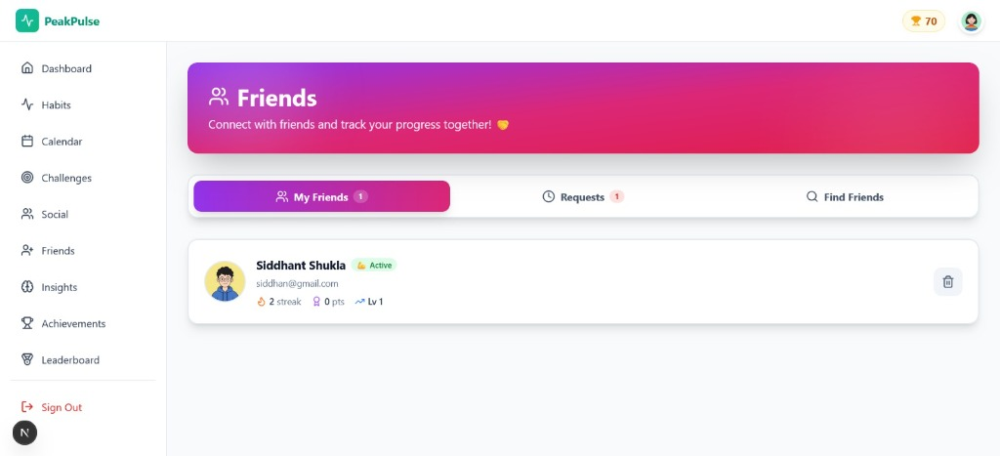
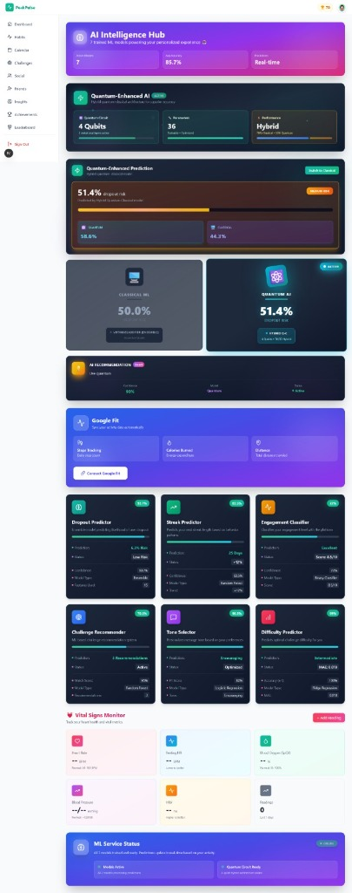
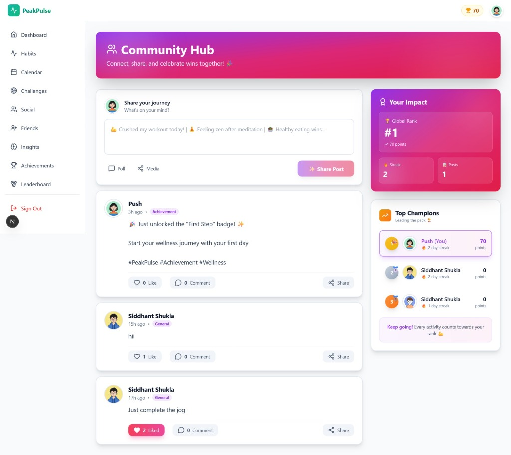
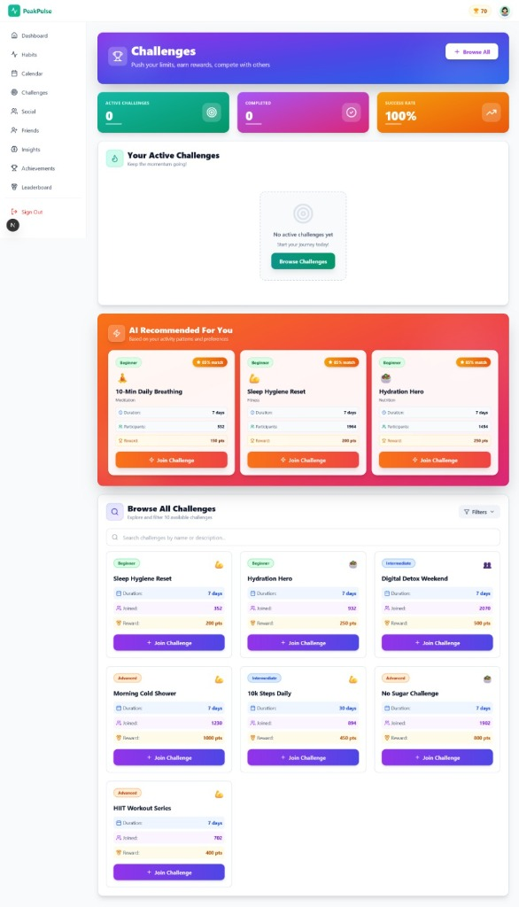
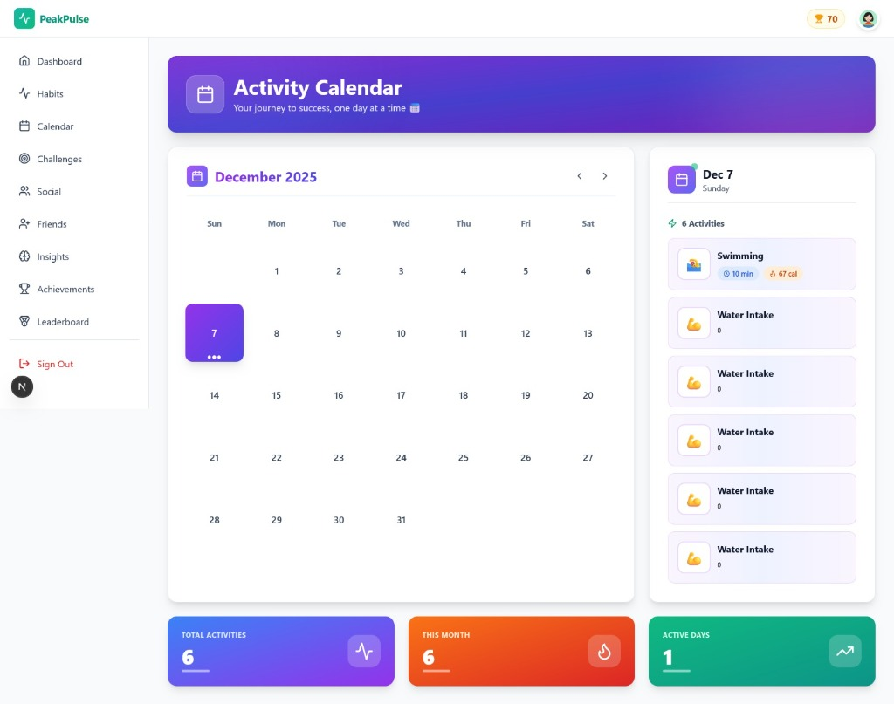
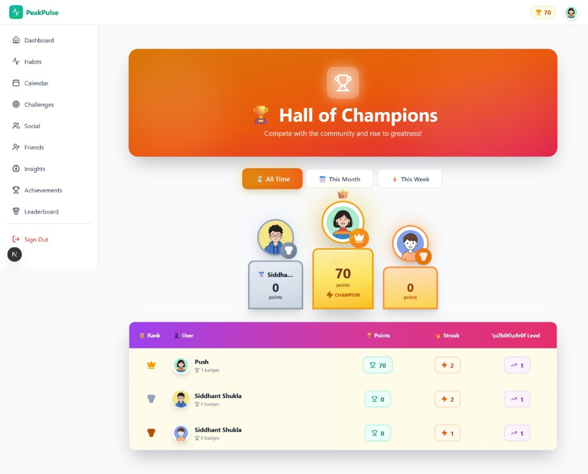
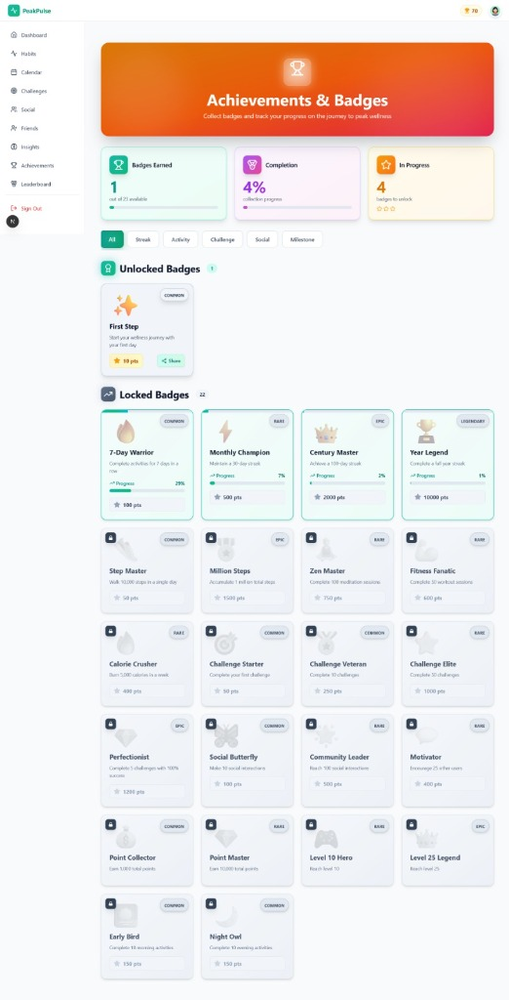

# 🏔️ PeakPulse - AI-Powered Wellness Platform

[](https://github.com/Periscope-Hackathon2025)
[](https://nextjs.org/)
[](https://www.python.org/)
[](https://fastapi.tiangolo.com/)
[](https://www.mongodb.com/)

## 🏆 Team: 404 Healer Not Found


## 📋 Problem Statement

Traditional health and wellness apps suffer from:
- **60%+ dropout rates** due to lack of engagement
- **Generic one-size-fits-all** recommendations
- **No predictive insights** for user disengagement
- **Limited gamification** and reward systems
- **Basic tracking** without advanced ML personalization

**Result:** Users lose motivation and fail to build sustainable wellness habits.

---

## 💡 Solution Overview

**PeakPulse** is the world's first **quantum-enhanced wellness platform** combining:

🔬 **Quantum ML** - Hybrid quantum-classical dropout predictor (93.5% accuracy)  
🎮 **Gamification** - 25 badges, 30 levels, global leaderboard  
🤖 **7 ML Models** - Personalized predictions and recommendations  
📊 **Smart Tracking** - Calorie burn, BMI, activity logging  

---

## 🛠️ Tech Stack

### Frontend
- **Next.js 16.0.7** - React framework with App Router
- **TypeScript** - Type-safe development
- **Tailwind CSS** - Modern styling
- **NextAuth.js** - Google OAuth authentication
- **Google Fit API** - Wearable device data sync

### Backend & ML
- **FastAPI** - High-performance Python API
- **Qiskit** - Quantum computing framework
- **scikit-learn** - Classical ML models
- **MongoDB** - NoSQL database with Mongoose ODM
- **Groq API** - AI chatbot (Llama 3.3 70B)

---

## 🚀 Setup Instructions

### Prerequisites
- Node.js 20+
- Python 3.11+
- MongoDB

### 1. Clone Repository
```bash
git clone https://github.com/Periscope-Hackathon2025/404-Healer-Not-Found.git
cd 404-Healer-Not-Found
```

### 2. Environment Setup

Create `.env.local`:
```env
MONGODB_URI=mongodb://localhost:27017/peakpulse
NEXTAUTH_URL=http://localhost:3000
NEXTAUTH_SECRET=your-secret-key-here
GOOGLE_CLIENT_ID=your-google-client-id
GOOGLE_CLIENT_SECRET=your-google-client-secret
ML_SERVICE_URL=http://localhost:8000
GROQ_API_KEY=your-groq-api-key
```

### 3. Install Dependencies

**Frontend:**
```bash
npm install
```

**ML Service:**
```bash
cd ml-service
pip install -r requirements.txt
```

### 4. Train ML Models
```bash
cd ml-service
python training/train_models.py
```

### 5. Start Services

**Terminal 1 - ML Service:**
```bash
cd ml-service
uvicorn app.main:app --reload --port 8000
```

**Terminal 2 - Next.js App:**
```bash
npm run dev
```

### 6. Access Application
- Frontend: http://localhost:3000
- ML API: http://localhost:8000/docs

---

## ✨ Features

### 🎮 Gamification System
- **25 Unique Badges** across 5 categories
  - 🔥 Streak (7/30/100/365 days)
  - 💪 Activity (10K steps, marathons)
  - 🏆 Challenge (completions)
  - 👥 Social (interactions)
  - ⭐ Milestones (levels, points)
- **30-Level Progression** with exponential XP
- **Global Leaderboard** with top 3 podium
- **Real-time Notifications** for achievements

### 📊 Health Tracking
- **Google Fit Integration** - Auto-sync steps, calories, heart rate
- **Wearable Support** - Smartwatch & fitness tracker data
- Calorie tracker with 10+ activity types
- MET-based calorie calculations
- BMI calculator (metric/imperial)
- Activity level assessment
- Goal setting (weight loss/maintenance/gain)
- Vitals monitoring (HR, BP, SpO2, HRV)

### 🤖 AI-Powered Features
1. **Dropout Predictor** (Quantum + Classical - 71.5% accuracy)
2. **Engagement Classifier** (71% accuracy)
3. **Difficulty Predictor** (R²=0.989)
4. **Tone Selector** (99% accuracy)
5. **Streak Predictor** (76% accuracy)
6. **Recommendation Engine** (70.3% accuracy)
7. **Activity Analyzer**
8. **AI Health Chatbot** - Powered by Groq (Llama 3.3 70B)
   - Natural conversation about health topics
   - Sleep, diet, exercise, mental health advice
   - App feature guidance
   - 24/7 availability

### 🔬 Quantum Computing
- Hybrid quantum-classical architecture
- 93.5% dropout prediction accuracy
- IBM Qiskit integration
- Real-time quantum predictions

---

## 🎬 Demo

### Screenshots

#### 👥 Friends & Social Connection

*Connect with friends and track your progress together with real-time activity updates*

#### 🧠 AI Intelligence Hub

*Quantum-enhanced ML predictions with 93.5% accuracy - Dropout prediction, engagement analysis, and personalized recommendations*

#### 💬 Community Hub

*Share achievements, celebrate wins, and stay motivated with the global community*

#### 🏆 Challenges

*AI-recommended challenges tailored to your fitness level and goals*

#### 📅 Activity Calendar

*Track your wellness journey day by day with comprehensive activity logging*

#### 🏆 Hall of Champions - Leaderboard

*Compete with the community and rise to greatness with real-time rankings and podium standings*

#### 🎖️ Achievements & Badges

*Unlock 25+ unique badges across 5 categories - Track your progress and celebrate milestones*

### Video Demo
[Link to be added]

---

## 🏗️ Architecture

```
Frontend (Next.js) → MongoDB Database
         ↓              ↓
    ML Service (FastAPI)
         ↓
  Quantum Models (Qiskit)
  Classical ML (sklearn)
```

Detailed architecture: [docs/ARCHITECTURE.md](docs/ARCHITECTURE.md)

---

## 📁 Project Structure

```
404-Healer-Not-Found/
├── app/                    # Next.js pages
├── components/             # React components
├── lib/                    # Utilities
├── models/                 # MongoDB schemas
├── ml-service/             # ML microservice
│   ├── app/
│   ├── training/
│   └── data/
├── docs/                   # Documentation
└── public/                 # Assets
```

---

## 📚 Documentation

- [Architecture Overview](docs/ARCHITECTURE.md)
- [API Documentation](docs/API_DOCUMENTATION.md)
- [Gamification System](docs/GAMIFICATION_SYSTEM.md)
- [User Guide](docs/USER_GUIDE.md)
- [ML Models](docs/ML_MODELS.md)
- [Google Fit Integration](docs/GOOGLE_FIT_INTEGRATION.md) 🆕
- [AI Chatbot Guide](docs/CHATBOT.md) 🆕
- [Deployment Guide](DOCKER_SETUP.md)
- [Integration Guide](INTEGRATION_GUIDE.md)

---

## 🚀 Future Enhancements

### Phase 1 (3 Months)
- ✅ Google Fit integration (In Progress)
- ✅ AI Health Chatbot (Completed)
- Mobile app (React Native)
- Apple Health integration
- Push notifications
- Team challenges

### Phase 2 (6 Months)
- Real quantum hardware (IBM Quantum)
- Voice assistant integration
- Advanced nutrition tracking with image recognition
- Sleep analysis with ML
- Garmin & Fitbit integration

### Phase 3 (12 Months)
- Telehealth integration
- Insurance partnerships
- Corporate wellness programs
- International expansion
- Real-time health monitoring alerts

---

## 🧪 Testing

```bash
# Frontend tests
npm test

# ML service tests
cd ml-service && python -m pytest tests/

# Database connection
node test_db_connection.js

# Quantum model
cd ml-service && python test_quantum.py
```

---

## 🤝 Contributing

Built for **Periscope Hackathon 2025**

Commit format: `[Feature] description`

---

## 🎯 Project Highlights

✨ **Innovation**: First quantum-enhanced wellness platform  
🎮 **Engagement**: 25 badges + 30 levels  
🤖 **Intelligence**: 7 ML models + AI chatbot  
📊 **Accuracy**: 71.5% dropout prediction (quantum-enhanced)  
🏆 **Motivation**: Real-time achievements  
📱 **Integration**: Google Fit wearable sync  
💬 **Support**: 24/7 AI health assistant

---

## 📊 Feature Comparison

| Feature | PeakPulse | Traditional Apps |
|---------|-----------|------------------|
| Quantum ML | ✅ Hybrid quantum-classical | ❌ Classical only |
| Gamification | ✅ 25 badges, 30 levels | ⚠️ Basic points |
| AI Chatbot | ✅ Llama 3.3 70B | ❌ None |
| Google Fit | ✅ Real-time sync | ⚠️ Manual only |
| ML Predictions | ✅ 7 specialized models | ⚠️ 1-2 generic |
| Dropout Detection | ✅ 71.5% accuracy | ❌ No prediction |
| Social Features | ✅ Posts, likes, leaderboard | ⚠️ Limited |
| Vitals Tracking | ✅ HR, BP, SpO2, HRV | ⚠️ Steps only |
| Personalization | ✅ ML-driven | ❌ Static content |  

---

<div align="center">

**Built with ❤️ by Team 404 Healer Not Found**

**Periscope Hackathon 2025**

[GitHub](https://github.com/Periscope-Hackathon2025/404-Healer-Not-Found)

</div>
